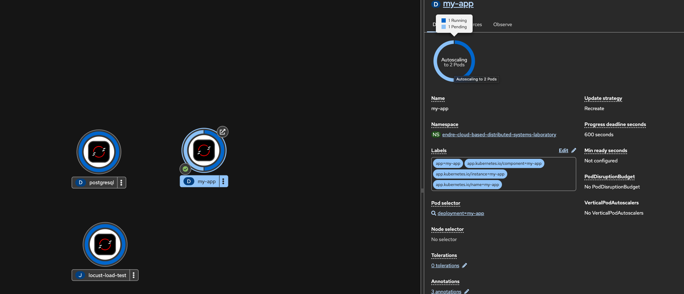
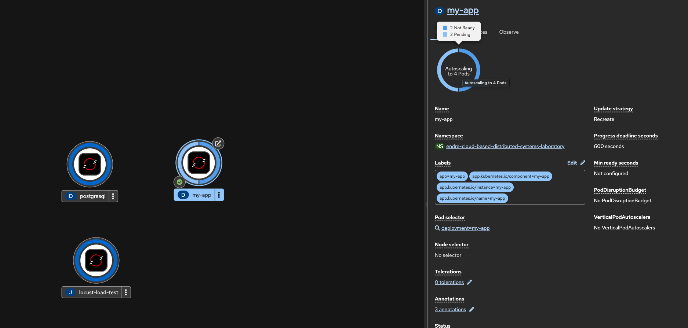
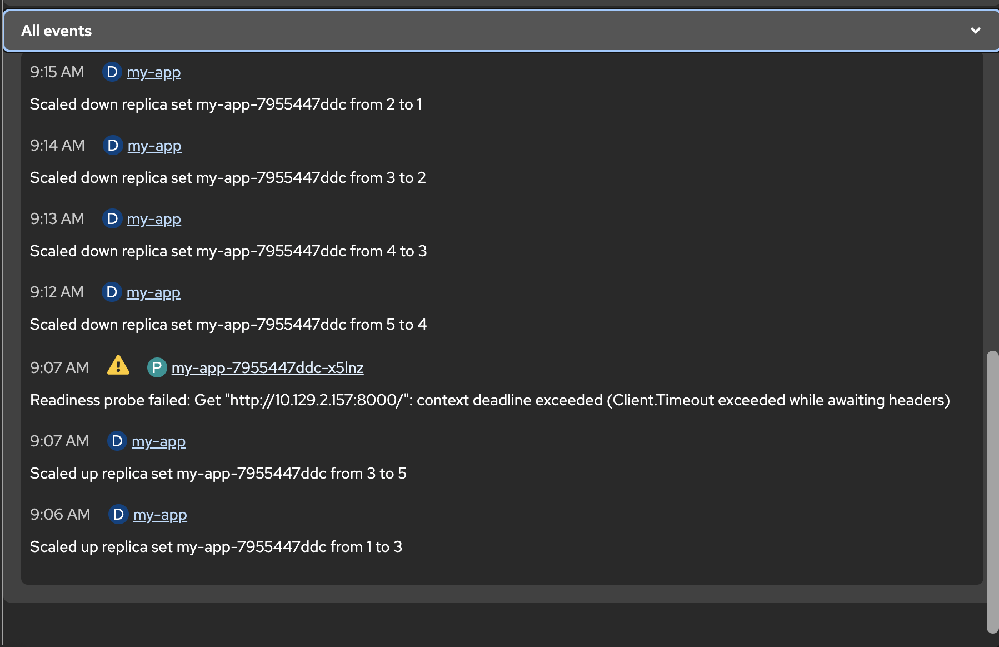
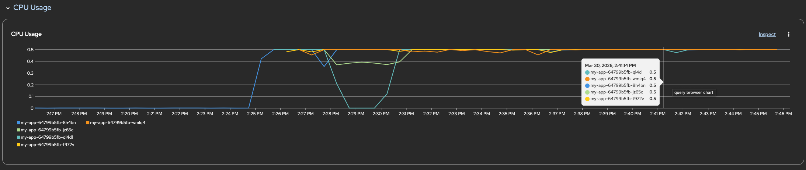
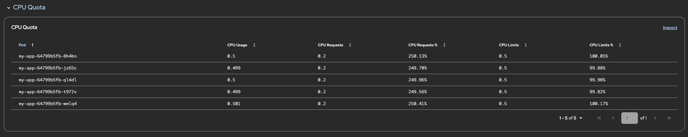
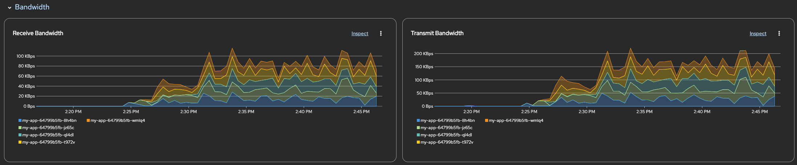
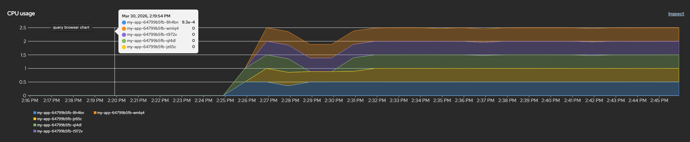
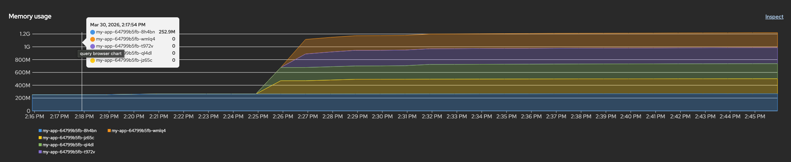
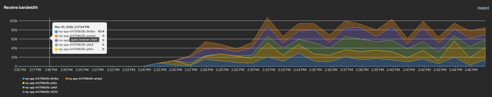

## Horizontal scaling of App-Galery:

<div style="text-align: center;">
  
  
  
  
  
  
  
  
  
</div>

```bash
Every 1.0s: oc get hpa my-app-hpa && echo "---" && oc get pods -l deployment=my-app                                                                                                                                                                                                     MacBook.local: Wed Mar 25 17:43:59 2026
                                                                                                                                                                                                                                                                                                                  in 0.387s (0)
NAME         REFERENCE           TARGETS        MINPODS   MAXPODS   REPLICAS   AGE
my-app-hpa   Deployment/my-app   cpu: 69%/50%   1         5         4          8h
---
NAME                    READY   STATUS              RESTARTS   AGE
my-app-7955c4df-297sj   0/1     ContainerCreating   0          58s
my-app-7955c4df-7pflj   0/1     ContainerCreating   0          58s
my-app-7955c4df-kht8g   1/1     Running             0          58s
my-app-7955c4df-rgclg   1/1     Running             0          58s
```

## Final results of Locust stress test:

```bash
Type     Name                                                                          # reqs      # fails |    Avg     Min     Max    Med |   req/s  failures/s
--------|----------------------------------------------------------------------------|-------|-------------|-------|-------|-------|-------|--------|-----------
GET      /                                                                                566     2(0.35%) |   2876       4   30007    650 |    0.94        0.00
GET      / [gallery default]                                                              550     0(0.00%) |   2677      10   25618    490 |    0.92        0.00
GET      / [id refresh]                                                                   544     0(0.00%) |    373       5    9383    150 |    0.91        0.00
GET      / [pre-view gallery]                                                             533     0(0.00%) |   1179       9   11720    230 |    0.89        0.00
GET      / [sort date desc]                                                               543     0(0.00%) |   1257       8   19635    220 |    0.91        0.00
GET      / [sort title asc]                                                               546     1(0.18%) |   1775       6   19229    270 |    0.91        0.00
POST     /delete/<id>/ [POST]                                                             531     0(0.00%) |   1716      15   13813    380 |    0.89        0.00
GET      /new-post/                                                                       540     0(0.00%) |   1364       7   19629    190 |    0.90        0.00
POST     /new-post/ [POST upload]                                                         540     0(0.00%) |    900      12   10703    500 |    0.90        0.00
GET      /users/login/                                                                    566     0(0.00%) |    556       6   19404    190 |    0.94        0.00
POST     /users/login/ [POST]                                                             553     2(0.36%) |  13208    1705   45500  11000 |    0.92        0.00
POST     /users/logout/ [POST final]                                                      526     0(0.00%) |   1822      14   15668    510 |    0.88        0.00
POST     /users/logout/ [POST]                                                            566     0(0.00%) |   1071       7   16610    600 |    0.94        0.00
GET      /users/register/                                                                 574     0(0.00%) |   1930       8   14518    490 |    0.96        0.00
POST     /users/register/ [POST]                                                          574    12(2.09%) |   3179      10   42316    470 |    0.96        0.02
--------|----------------------------------------------------------------------------|-------|-------------|-------|-------|-------|-------|--------|-----------
         Aggregated                                                                      8252    17(0.21%) |   2403       4   45500    400 |   13.77        0.03

Response time percentiles (approximated)
Type     Name                                                                                  50%    66%    75%    80%    90%    95%    98%    99%  99.9% 99.99%   100% # reqs
--------|--------------------------------------------------------------------------------|--------|------|------|------|------|------|------|------|------|------|------|------
GET      /                                                                                     660   2500   3800   4500   8600  10000  21000  26000  30000  30000  30000    566
GET      / [gallery default]                                                                   540   2400   3800   4900   8200  10000  19000  21000  26000  26000  26000    550
GET      / [id refresh]                                                                        150    210    310    400    610   1200   3200   6900   9400   9400   9400    544
GET      / [pre-view gallery]                                                                  230    770   1400   2000   3800   5600   7800   8600  12000  12000  12000    533
GET      / [sort date desc]                                                                    220    680   1700   2500   4000   5500   8600   9500  20000  20000  20000    543
GET      / [sort title asc]                                                                    270   1300   2700   3400   5600   7700  10000  13000  19000  19000  19000    546
POST     /delete/<id>/ [POST]                                                                  380   1400   2800   3500   5000   6600   9800  11000  14000  14000  14000    531
GET      /new-post/                                                                            190    720   2000   2600   4400   6200   8800  10000  20000  20000  20000    540
POST     /new-post/ [POST upload]                                                              500    870   1100   1300   1800   3400   5500   6500  11000  11000  11000    540
GET      /users/login/                                                                         190    290    350    410    760   1800   6000   9600  19000  19000  19000    566
POST     /users/login/ [POST]                                                                11000  13000  15000  17000  22000  28000  29000  36000  46000  46000  46000    553
POST     /users/logout/ [POST final]                                                           510   2000   3100   3500   5100   6500   9500  11000  16000  16000  16000    526
POST     /users/logout/ [POST]                                                                 600    990   1200   1300   1900   4200   7400   7900  17000  17000  17000    566
GET      /users/register/                                                                      500   2000   3100   3800   5700   7700   9100  10000  15000  15000  15000    574
POST     /users/register/ [POST]                                                               490    800    970   1000   6600  30000  36000  38000  42000  42000  42000    574
--------|--------------------------------------------------------------------------------|--------|------|------|------|------|------|------|------|------|------|------|------
         Aggregated                                                                            400   1100   2500   3500   7800  11000  19000  26000  37000  46000  46000   8252

Error report
# occurrences      Error
------------------|---------------------------------------------------------------------------------------------------------------------------------------------
12                 POST /users/register/ [POST]: Register failed: 504
2                  GET /: HTTPError('504 Server Error: Gateway Time-out for url: /')
2                  POST /users/login/ [POST]: Login failed: 504
1                  GET / [sort title asc]: RemoteDisconnected('Remote end closed connection without response')
------------------|---------------------------------------------------------------------------------------------------------------------------------------------

Copying results...
error: unable to upgrade connection: container not found ("locust")
Done! Results saved to ./locust-results/
Clean up
job.batch "locust-load-test" deleted from endre-cloud-based-distributed-systems-laboratory namespace
configmap "locust-config" deleted from endre-cloud-based-distributed-systems-laboratory namespace
```